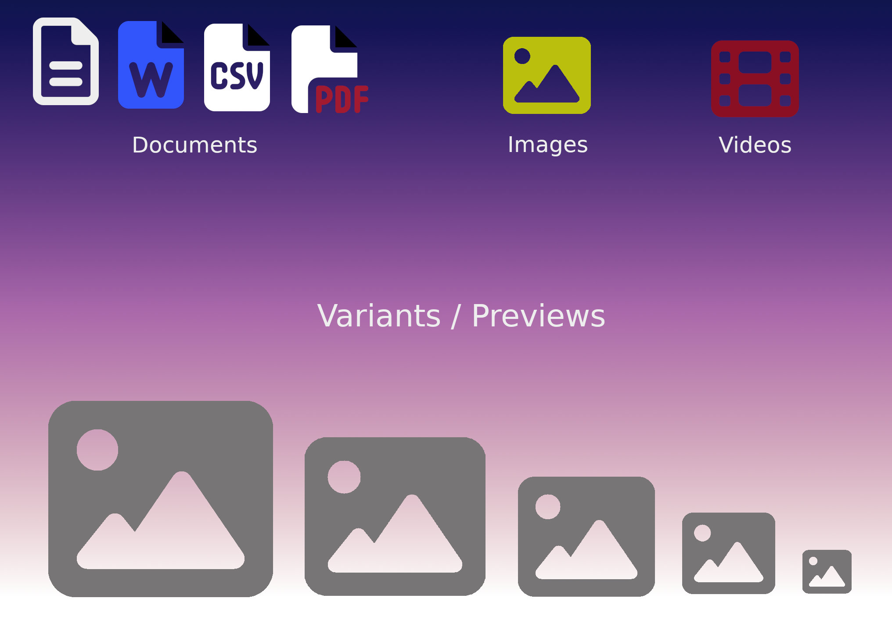

# Attachment Advanced

<div align="center">
  
</div>

---

[![license-image]][license-url] [![typescript-image]][typescript-url]

A simple, opinionated package to convert any column on your Lucid model to an attachment data type.

Attachment advanced allows you to store a reference of user uploaded files within the database. It does not require any additional database tables and stores the file metadata as JSON within the same column.

## How it works?
The `attachment-advanced` package is **an alternative to the media library approach**. I believe media libraries are great when creating a CMS that wants a central place to keep all the images/documents.

However, many applications like a SAAS product or a community forum do not need media libraries.

For example, websites like Twitter or dev.to don't have a media library section where you upload and choose images from. Instead, images on these platforms are tightly coupled with the resource.

When you update your profile image on Twitter, the old image disappears, and the new one appears. There is no central gallery of images to choose the profile picture from.

A very long story to tell you that the `attachment-advanced` package is an excellent solution for managing one-off file uploads in your application.

## Features
- Turn any column in your database to an attachment data type.
- No additional database tables are required. The file metadata is stored as JSON within the same column.
- Automatically removes the old file from the disk when a new file is assigned.
- Handles failure cases gracefully. No files will be stored if the model fails to persist.
- Similarly, no old files are removed if the model fails to persist during an update or the deletion fails.

## Attachment-lite vs Attachment-advanced

`Attachment-advanced` is a fork of `Attachment-lite`. Attachment-advanced includes all the functionality of attachment-lite.

Attachment-advanced adds the ability to generate `variants`/`previews` of the upload.

It is possible to automatically generate variants of the image files. For example, generate a thumbnail, medium and large image.

In the same way, it is possible to create previews for document and video files 

Migratation `Attachment-lite` in `Attachment-advanced` is easy. All feature `Attachment-lite` is compatible with `Attachment-advanced`

## Pre-requisites
The `attachment-advanced` package requires `@adonisjs/lucid >= v16.3.1` and `@adonisjs/core >= 5.3.4`.

Also, it relies on [AdonisJS drive](https://docs.adonisjs.com/guides/drive) for writing files on the disk.

For document preview, it's required `LibreOffice` or `OpenOffice` software.

If you only want PDF documents, prefere `poppler` software.

For video preview, it's required [FFmpeg](http://www.ffmpeg.org) software.

## Supported formats

| Format | required |
| ----------- | ----------- |
| jpeg |  |
| png |  | 
| gif |  | 
| webp |  | 
| avif |  | 
| tiff |  | 
| mp4 | FFmpeg | 
| webm | FFmpeg | 
| mov | FFmpeg | 
| avi | FFmpeg | 
| mpeg | FFmpeg | 
| 3gp | FFmpeg | 
| ogg | FFmpeg | 
| flv | FFmpeg | 
| mkv | FFmpeg | 
| pdf | LibreOffice / OpenOffice / poppler | 
| odt | LibreOffice / OpenOffice |
| ods | LibreOffice / OpenOffice |
| docx | LibreOffice / OpenOffice | 
| doc | LibreOffice / OpenOffice | 
| numbers | LibreOffice / OpenOffice | 
| pages | LibreOffice / OpenOffice |  
| xlsx | LibreOffice / OpenOffice | 
| xls | LibreOffice / OpenOffice | 
| csv | LibreOffice / OpenOffice | 
| rtf | LibreOffice / OpenOffice | 
| txt | LibreOffice / OpenOffice |

## Setup
Install the package from the npm registry as follows.

```sh
npm i @jrmc/attachment-advanced
```

Next, configure the package by running the following ace command.

```sh
node ace configure @jrmc/attachment-advanced
```

## Config
Configuration for variants/previews files (`config/attachment.ts`)

```
const attachmentConfig: AttachmentConfig = {
  document: {
    previews: {
      thumbnail: {
        resize: 300,
        format: 'webp'
      },
      large: {
        resize: 1024,
        format: 'jpg'
      },
    }
  },
  video: {
    previews: {
      thumbnail: {
        resize: 1024,
        format: 'jpg'
      },
    }
  },
  pdf: {
    bin: '/usr/bin', // optionnal
    previews: {
      thumbnail: {
        resize: 300,
        format: 'jpg'
      },
    }
  },
  image: {
    variants: {
      square: { // Write 200px square auto-cropped image data to writableStream
      square: { // Write 200px square auto-cropped image data to writableStream
        resize: {
          width: 200,
          height: 200,
          fit: sharp.fit.cover,
          position: sharp.strategy.entropy
        }
      },
      bg: {
        resize: { // contained within the north-east corner of a semi-transparent white canvas
          width: 200,
          height: 300,
          kernel: sharp.kernel.nearest,
          fit: 'contain',
          position: 'right top',
          background: { r: 255, g: 0, b: 0, alpha: 0.5 }
        }
      },
      thumbnail: {
        resize: 300,
        format: 'jpg'
      },
      medium: {
        resize: {
          width: 500,
          fit: 'contain',
          position: 'right top',
        },
        format: [ 'jpg', {
            quality: 10,
            progressive: true
        }]
      },
      large: {
        resize: 1500,
        format: 'jpg'
      }
    }
  }
}
```

Variant image is generate by [sharp module](https://sharp.pixelplumbing.com)

Options resize is `number` or `object`(options) details in documentation : [sharp api resize](https://sharp.pixelplumbing.com/api-resize)

Options format is `string` or `array` [ format,  options ] details in documentation : [sharp api outpout](https://sharp.pixelplumbing.com/api-output#toformat)

## Usage

Often times, the size of the image metadata could exceed the allowable length of an SQL `String` data type. So, it is recommended to create/modify the column which will hold the metadata to use a `JSON` data type. 

If you are creating the column for the first time, make sure that you use the JSON data type. Example:

```ts
  // Within the migration file

  protected tableName = 'users'
  
  public async up() {
    this.schema.createTable(this.tableName, (table) => {
      table.increments()
      table.json('avatar') // <-- Use a JSON data type
    })
  }
```

If you already have a column for storing image paths/URLs, you need to create a new migration and alter the column definition to a JSON data type. Example:

```bash
# Create a new migration file
node ace make:migration change_avatar_column_to_json --table=users
```

```ts
  // Within the migration file
  
  protected tableName = 'users'

  public async up() {
    this.schema.alterTable(this.tableName, (table) => {
      table.json('avatar').alter() // <-- Alter the column definition
    })
  }
```

Next, in the model, import the `attachment` decorator and the `AttachmentContract` interface from the package.

> Make sure NOT to use the `@column` decorator when using the `@attachment` decorator.

```ts
import { BaseModel } from '@ioc:Adonis/Lucid/Orm'
import {
  attachment,
  AttachmentContract
} from '@ioc:Adonis/Addons/AttachmentAdvanced'

class User extends BaseModel {
  @attachment()
  public avatar: AttachmentContract
}
```

Now you can create an attachment from the user uploaded file as follows.

```ts
import { Attachment } from '@ioc:Adonis/Addons/AttachmentAdvanced'

class UsersController {
  public store({ request }: HttpContextContract) {
    const avatar = request.file('avatar')!
    const user = new User()

    user.avatar = Attachment.fromFile(avatar)
    await user.save()
  }
}
```

The `Attachment.fromFile` creates an instance of the Attachment class from the user uploaded file. When you persist the model to the database, the attachment-lite will write the file to the disk.

### Handling updates
You can update the property with a newly uploaded user file, and the package will take care of removing the old file and storing the new one.

```ts
import { Attachment } from '@ioc:Adonis/Addons/AttachmentAdvanced'

class UsersController {
  public update({ request }: HttpContextContract) {
    const user = await User.firstOrFail()
    const avatar = request.file('avatar')!

    user.avatar = Attachment.fromFile(avatar)

    // Old file will be removed from the disk as well.
    await user.save()
  }
}
```

Similarly, assign `null` value to the model property to delete the file without assigning a new file. 

Also, make sure you update the property type on the model to be `null` as well.

```ts
class User extends BaseModel {
  @attachment()
  public avatar: AttachmentContract | null
}
```

```ts
const user = await User.first()
user.avatar = null

// Removes the file from the disk
await user.save()
```

### Handling regenerations
If you want to regenerate all the variants of an attachment property. Three methods are available.

#### 1- Static method for one entity

```ts
import { Attachment } from '@ioc:Adonis/Addons/AttachmentAdvanced'

class UsersController {
  public update({ request }: HttpContextContract) {
    const user = await User.findOrFail(request.param('id'))

    user.avatar = Attachment.regenerate(user.avatar)

    // or specify variant
    user.avatar = Attachment.regenerate(user.avatar, 'medium')

    // or specify multiple variants
    user.avatar = Attachment.regenerate(user.avatar, ['thumbnail', 'large'])

    await user.save()
  }
}
```

#### 2- Method Class for all entities

```ts
import { compose } from '@ioc:Adonis/Core/Helpers'
import { attachment, AttachmentContract, Attachmentable } from '@ioc:Adonis/Addons/AttachmentAdvanced'

class User extends compose(BaseModel, Attachmentable) {
  @attachment()
  public avatar: AttachmentContract | null
}
```

```ts
  await User.attachmentRegenerate()

  // or specify variant
  await User.attachmentRegenerate('medium')

  // or specify multiple variants
  await User.attachmentRegenerate(['thumbnail', 'large'])
```

#### 3- Command Ace

```
  # Regenerate all attachment for all models
  node ace attachment:regenerate

  # Regenerate all attachment for User Model
  node ace attachment:regenerate --model User
  node ace attachment:regenerate -M User

  # Regenerate specify variants for all attachment for all Models
  node ace attachment:regenerate --variants large,medium
  node ace attachment:regenerate -V large,medium

  # Regenerate specify variant for specify Model 
  node ace attachment:regenerate -M User -V large
```

Note: Attachment command required `Attachmentable` in Models

### Handling deletes
Upon deleting the model instance, all the related attachments will be removed from the disk.

> Do note: For attachment lite to delete files, you will have to use the `modelInstance.delete` method. Using `delete` on the query builder will not work.

```ts
const user = await User.first()

// Removes any attachments related to this user
await user.delete()
```

## Specifying disk
By default, all files are written/deleted from the default disk. However, you can specify a custom disk at the time of using the `attachment` decorator.

> The `disk` property value is never persisted to the database. It means, if you first define the disk as `s3`, upload a few files and then change the disk value to `gcs`, the package will look for files using the `gcs` disk.

```ts
class User extends BaseModel {
  @attachment({ disk: 's3' })
  public avatar: AttachmentContract
}
```

## Specifying subfolder

You can also store files inside the subfolder by defining the `folder` property as follows.

```ts
class User extends BaseModel {
  @attachment({ folder: 'avatars' })
  public avatar: AttachmentContract
}
```

## Specifying variants

It is possible to limit the variants on an attachment

```ts
class User extends BaseModel {
  @attachment({ variants: ['thumbnail', 'medium'] })
  public avatar: AttachmentContract
}
```

## Disabled variants for a specific model

It is possible to disabled the variants for an attachment

```ts
class User extends BaseModel {
  @attachment({ variants: false })
  public avatar: AttachmentContract
}
```

## Generating URLs

You can generate a URL for a given attachment using the `getUrl` or `getSignedUrl` methods. They are identical to the [Drive methods](https://docs.adonisjs.com/guides/drive#generating-urls), just that you don't have to specify the file name and variant option

```ts
await user.avatar.getUrl()
await user.avatar.getUrl('thumbnail')

await user.avatar.getSignedUrl({ expiresIn: '30mins' })
await user.avatar.getSignedUrl({ variant: 'thumbnail' })
await user.avatar.getSignedUrl({ variant: 'thumbnail', expiresIn: '30mins' })
```

## Generating URLs for the API response

The Drive API methods for generating URLs are asynchronous, whereas serializing a model to JSON is synchronous. Therefore, it is not to create URLs at the time of serializing a model.

```ts
// ❌ Does not work

const users = await User.all()
users.map((user) => {
  user.avatar.url = await user.avatar.getSignedUrl()
  return user
})
```

To address this use case, you can opt for pre-computing URLs

### Pre compute URLs

Enable the `preComputeUrl` flag to pre compute the URLs after SELECT queries. For example:

```ts
class User extends BaseModel {
  @attachment({ preComputeUrl: true })
  public avatar: AttachmentContract
}
```

Fetch result

```ts
const users = await User.all()
users[0].avatar.url // pre computed already 

users[0].avatar.variants?.thumbnail?.url // pre computed already
user.avatar.variant('thumbnail')?.url // pre computed already
user.avatar.preview('thumbnail')?.url // alias variant()
```

Find result

```ts
const user = await User.findOrFail(1)
user.avatar.url // pre computed already 
```

Pagination result

```ts
const users = await User.query.paginate(1)
users[0].avatar.url // pre computed already 
```

The `preComputeUrl` property will generate the URL and set it on the Attachment class instance. Also, a signed URL is generated when the disk is **private**, and a normal URL is generated when the disk is **public**.

### Pre compute on demand

We recommend not enabling the `preComputeUrl` option when you need the URL for just one or two queries and not within the rest of your application.

For those couple of queries, you can manually compute the URLs within the controller. Here's a small helper method that you can drop on the model directly.

```ts
class User extends BaseModel {
  public static async preComputeUrls(models: User | User[]) {
    if (Array.isArray(models)) {
      await Promise.all(models.map((model) => this.preComputeUrls(model)))
      return
    }

    await models.avatar?.computeUrl()
    await models.coverImage?.computeUrl()
  }
}
```

And now use it as follows.

```
const users = await User.all()
await User.preComputeUrls(users)

return users
```

Or for a single user

```ts
const user = await User.findOrFail(1)
await User.preComputeUrls(user)

return user
```

## Using Attachment advanced with model factories
Attachment advanced primarly uses the multipart request body to persist user upload files. However, you can also construct an instance of `Attachment` class manually and use the AdonisJS drive to persist the corresponding file.

In the following example, we create an instance of the Attachment class to represent the Post cover image.

```ts
import Post from 'App/Models/Post'
import Drive from '@ioc:Adonis/Core/Drive'
import { file } from '@ioc:Adonis/Core/Helpers'
import Factory from '@ioc:Adonis/Lucid/Factory'
import { Attachment } from '@ioc:Adonis/Addons/AttachmentAdvanced'

export default Factory.define(Post, async ({ faker }) => {
  /**
   * Step 1: Create an instance of attachment
   */
  const coverImage = new Attachment({
    extname: 'png',
    mimeType: 'image/png',
    size: 10 * 1000,
    name: `${faker.random.alphaNumeric(10)}.png`,
  })

  /**
   * Step 2: Mark image as persisted, this will disable the
   * functions of attachment advanced that looks for multipart
   * body and attempts to write the file from the stream
   */
  coverImage.isPersisted = true

  /**
   * Step 3: Persist the file using Drive.
   */
  await Drive.put(coverImage.name, (await file.generatePng('1mb')).contents)

  return {
    title: faker.lorem.words(5),
    coverImage: coverImage,
  }
}).build()
```

[license-image]: https://img.shields.io/npm/l/@jrmc/attachment-advanced?color=blueviolet&style=for-the-badge
[license-url]: LICENSE.md "license"

[typescript-image]: https://img.shields.io/badge/Typescript-294E80.svg?style=for-the-badge&logo=typescript
[typescript-url]:  "typescript"
